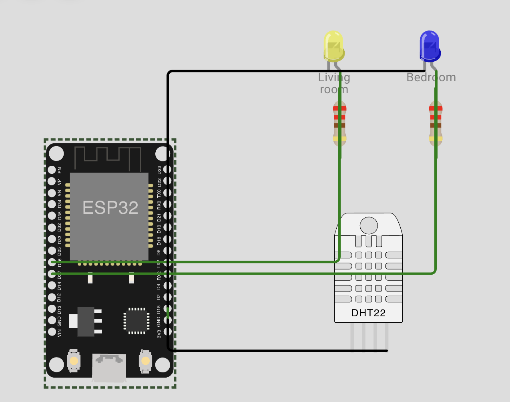
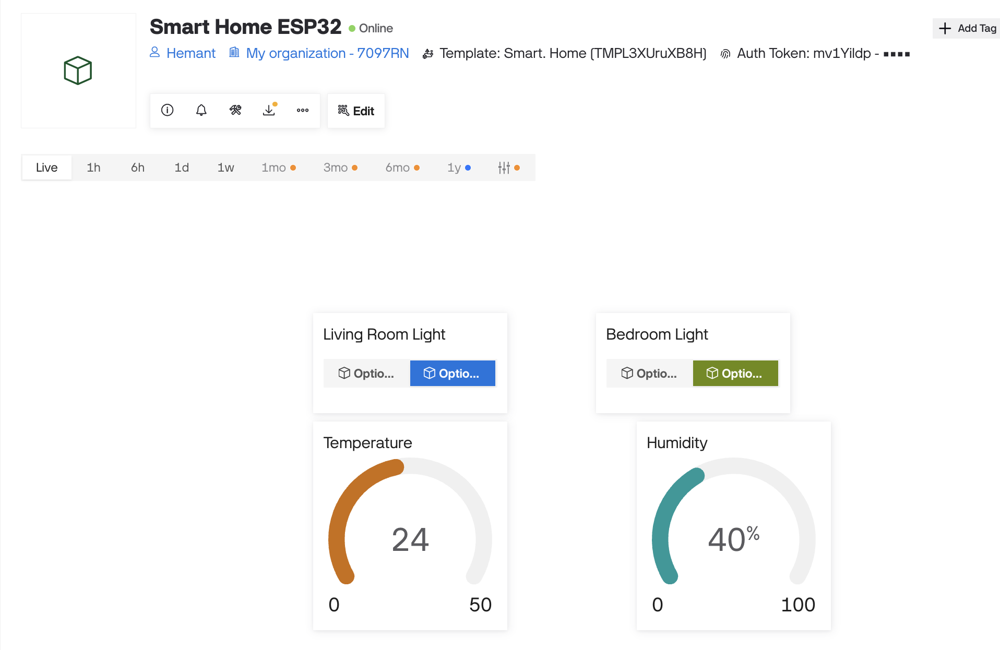
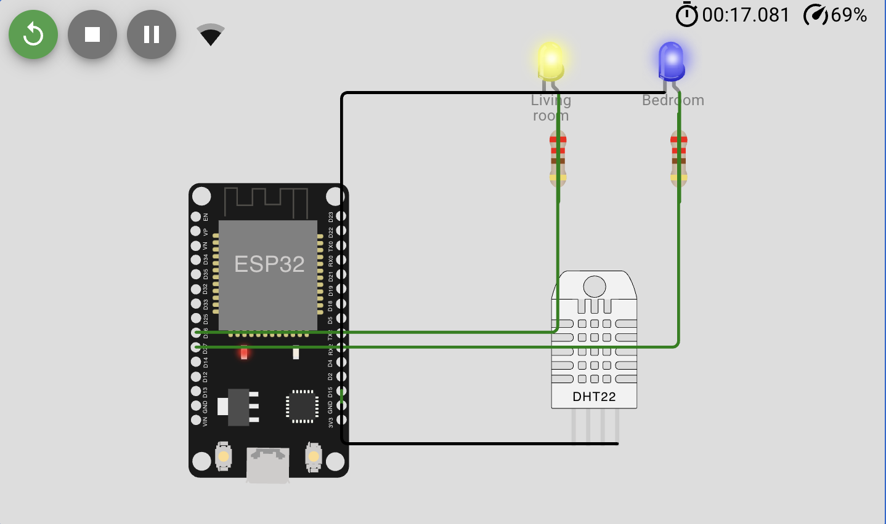

# Smart Home Automation (ESP32 + Blynk IoT)

An IoT smart home simulation built in Wokwi. An ESP32 connects to WiFi and to the Blynk cloud, so two room lights can be switched on and off from a Blynk dashboard, and the temperature and humidity measured by a DHT22 sensor are shown live on the same dashboard.

Built as the Tier 3 project of the Devotics Industrial Experience Program.

## Features

- Two lights (living room and bedroom) controlled remotely from the dashboard
- Live temperature and humidity readings from a DHT22 sensor
- The dashboard reads the real switch state back from the cloud when the ESP32 reconnects
- Every action is printed to the Serial Monitor

## Components

- ESP32 DevKit (simulated in Wokwi)
- 2 x LED (yellow = living room, blue = bedroom) with 220 ohm resistors
- DHT22 temperature and humidity sensor
- Blynk IoT cloud and web dashboard

## Circuit



| ESP32 pin | Connected to | Purpose |
|---|---|---|
| D26 | Resistor, then living room LED | Living room light |
| D27 | Resistor, then bedroom LED | Bedroom light |
| D15 | DHT22 SDA | Sensor data |
| 3V3 | DHT22 VCC | Sensor power |
| GND | LED cathodes and DHT22 GND | Ground |

## Blynk Setup

Template name: `Smart. Home` (ESP32, WiFi)

| Datastream | Pin | Type | Range | Used for |
|---|---|---|---|---|
| Living Room Light | V0 | Integer | 0 to 1 | Switch widget |
| Bedroom Light | V1 | Integer | 0 to 1 | Switch widget |
| Temperature | V2 | Double | 0 to 50 C | Gauge widget |
| Humidity | V3 | Double | 0 to 100 % | Gauge widget |

The web dashboard has two switch widgets and two gauge widgets, one for each datastream.



## How It Works

1. The ESP32 joins the simulated WiFi network `Wokwi-GUEST` and connects to Blynk with the template ID and an auth token.
2. When a switch changes in the dashboard, Blynk sends the value (0 or 1) to the matching datastream. The code handles it in `BLYNK_WRITE(V0)` or `BLYNK_WRITE(V1)` and turns the LED on or off.
3. Every 5 seconds a timer reads the DHT22 and sends the temperature to V2 and the humidity to V3.
4. When the ESP32 connects, `BLYNK_CONNECTED()` asks Blynk for the current switch values, so the lights match the dashboard.

## Simulation Result



Serial Monitor output:

```
Ready (ping: 214ms).
Living room light: OFF
Bedroom light: OFF
Temperature: 24.00 C, Humidity: 40.00 %
Living room light: ON
Bedroom light: ON
```

## How to Run

1. Create a Blynk template with the four datastreams above, a device from that template, and copy its template ID, template name and auth token.
2. Open a new ESP32 project in Wokwi. Paste `diagram.json` into the diagram tab and `smart_home.ino` into the sketch.
3. In Wokwi's Library Manager add `Blynk` and `DHT sensor library for ESPx`.
4. In `smart_home.ino`, replace `YOUR_AUTH_TOKEN` with your own device token. Never publish a real token.
5. Press Play, open the device in the Blynk web dashboard and click the switches.

## Notes

- The control panel used here is Blynk's web dashboard. The same template and device can also be controlled from the Blynk IoT mobile app, but the phone app was not tested for this project.
- The auth token in the code is a placeholder on purpose.

## Possible Improvements

- Replace the LEDs with a relay module to switch real mains lights
- Add a motion sensor and automatic lighting rules in Blynk automations
- Add a fan that turns on when the temperature goes above a limit
- Test the control from the Blynk mobile app

## Author

Hemant Yadav, 4th year BTech Robotics and Automation, Medicaps University
